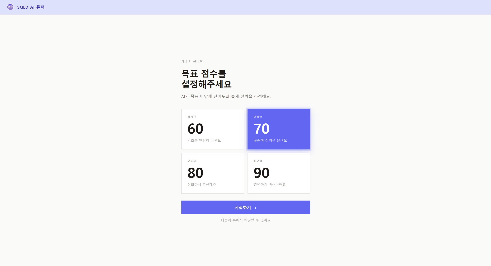
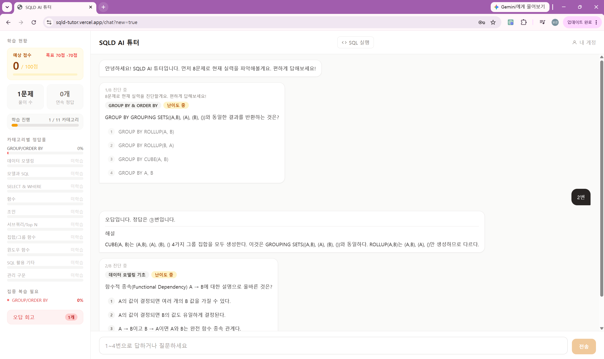
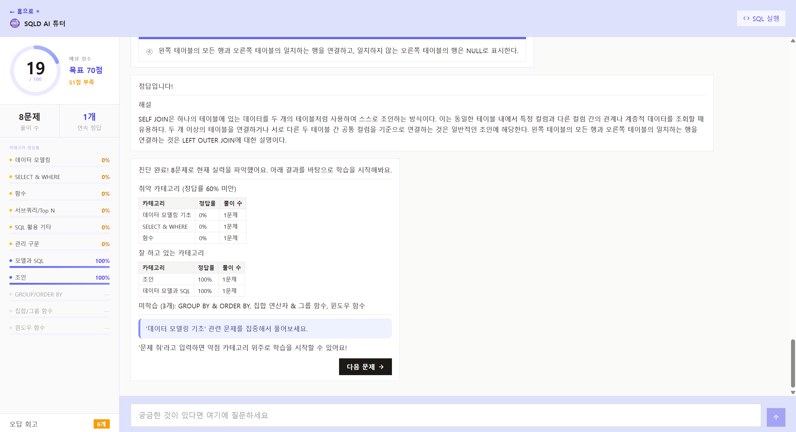
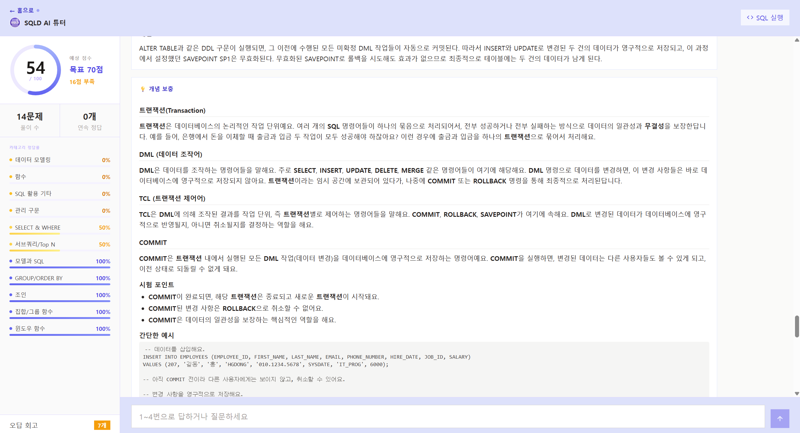
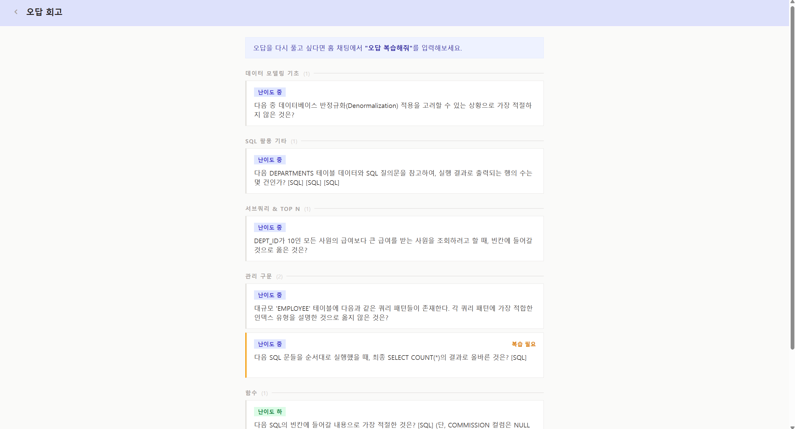
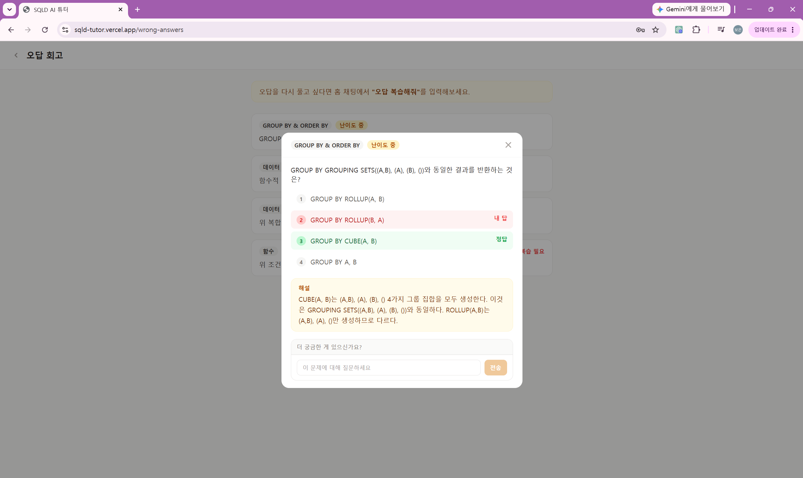
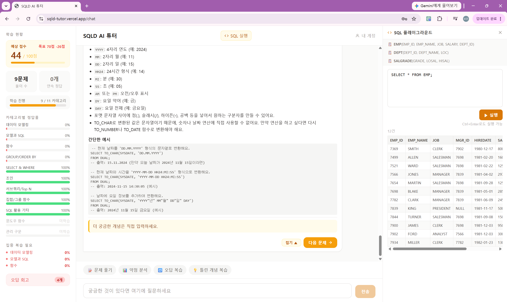

# SQLD AI 튜터

> SQLD 자격증 취득을 돕는 LangGraph 기반 적응형 AI 학습 서비스

**배포 URL:** https://sqld-tutor.vercel.app

---

## 프로젝트 소개

SQLD(SQL 개발자) 자격증 합격률이 41.7%까지 하락한 상황에서, 수험생 5명 설문 조사와 개발자 본인의 응시 경험을 바탕으로 학습 애로사항을 분석했습니다.

사전 설문 조사(5명)를 통해 5가지 핵심 페인포인트를 도출했습니다.

| 순위 | 페인포인트 | 언급 수 |
|------|-----------|--------|
| 1위 | 본인의 취약 영역을 스스로 파악하기 어렵다 | 4건 |
| 2위 | 개념은 이해했지만 문제에 적용이 안 된다 | 4건 |
| 3위 | 오답 복습이 번거롭고 자동화 도구가 없다 | 3건 |
| 4위 | 문제집 해설이 불충분해 왜 틀렸는지 모른다 | 3건 |
| 5위 | 내 공부 방식이 맞는지 확신이 없다 | 1건 |

이를 해결하기 위해 **진단 → 적응형 출제 → RAG 기반 개념 설명 → 오답 회고** 흐름을 갖춘 AI 튜터를 설계·구현하고, 실사용자 베타 테스트로 효과를 검증했습니다.

---

## 기술 스택

| 분류 | 기술 |
|------|------|
| AI 에이전트 | LangGraph |
| LLM | Gemini 2.5 Flash |
| RAG | ChromaDB |
| 백엔드 | FastAPI, Python |
| 프론트엔드 | Next.js 14, TypeScript, Tailwind CSS |
| 데이터베이스·인증 | Supabase (PostgreSQL), 카카오 OAuth |
| 배포 | Render (백엔드), Vercel (프론트엔드) |
| 관찰성 | LangSmith |

---

## 주요 기능

- **진단 8문제** — 최초 접속 시 11개 카테고리별 기초 실력 측정
- **적응형 출제** — 진단 결과 기반으로 취약 카테고리 문제 우선 출제
- **RAG 개념 설명** — 오답 시 11개 카테고리별 학습 DB에서 관련 개념 자동 제공
- **홈 학습 대시보드** — 90일 캘린더 히트맵, 간격반복 복습 일정(오늘/내일/이번 주/지연), 연속 학습 streak
- **모의고사** — 50문항 90분 타이머, SQLD 실제 시험 형식, 과목별 점수 및 정답 해설
- **약점 분석** — 누적 풀이 데이터 기반 카테고리별 학습 현황 리포트
- **오답 회고** — 틀린 문제 목록 조회 및 AI 추가 질문
- **SQL 실행기** — 개념 확인용 인터랙티브 SQL 실행 환경
- **예상 점수** — SQLD 실제 배점 기준 실시간 점수 산출
- **카카오 로그인** — 카카오 OAuth 소셜 로그인 (이메일/비밀번호 로그인 병행)
- **계정 관리** — 비밀번호 변경 및 회원 탈퇴

---

## 시스템 아키텍처

```
사용자 입력
    ↓
intent_classifier  ← 의도 분류 (drill / explain / review / diagnose / sql / chatbot)
    ↓
┌──────────┬──────────┬──────────┬──────────┬──────────┬──────────┐
│drill_node│explain   │review    │diagnose  │sql_node  │chatbot   │
│(문제출제)│_node     │_node     │_node     │(SQL실행) │(자유대화)│
│          │(개념설명)│(오답회고)│(진단출제)│          │          │
└──────────┴──────────┴──────────┴──────────┴──────────┴──────────┘
    ↓
state_updater  ← 정답률·streak·오답로그 갱신
    ↓
adaptive_difficulty_router  ← 다음 노드 결정 (explain 강제 유도 / 카테고리 전환 / END)
    ↓
SSE 스트리밍 응답 (token / message / concept / stats_updated / pending_question / done)
```

---

## 스크린샷

| 온보딩 | 진단 문제 |
|--------|---------|
|  |  |

| 진단 결과 분석 | 일반 문제 + 개념 설명 |
|--------------|-------------------|
|  |  |

| 오답 회고 목록 | 오답 상세 + 미니 채팅 |
|--------------|-------------------|
|  |  |

| SQL 실행기 |
|-----------|
|  |

---

## 베타 테스트 결과

SQLD 62회 응시 예정 수험생 3명, 약 30일 사용

| 지표 | 결과 |
|------|------|
| 30일 활성 사용률 | 3명 전원 100% |
| 약점 카테고리 정답률 향상 | 평균 +49.3%p |
| 1인당 월간 LLM 비용 | 약 $1.3 |
| 합격 수준 도달 (75점+) | 3명 중 1명 (246문제 풀이, 예상 91.2점) |

A/B 테스트 (자동 개념 설명 vs 직접 질문 방식): 3명 중 2명이 직접 질문 방식 선호

---

## 프로젝트 구조

```
sqld-tutor/
├── backend/
│   └── app/
│       ├── agent/
│       │   ├── graph.py          # LangGraph 그래프 정의 및 엣지 연결
│       │   ├── state.py          # 대화 상태 스키마 (TutorState)
│       │   ├── llm.py            # Gemini 2.5 Flash 클라이언트 초기화
│       │   ├── prompts.py        # 노드별 프롬프트 템플릿
│       │   ├── nodes/
│       │   │   ├── intent_classifier.py  # 사용자 의도 분류 (drill/explain/review/sql/chatbot)
│       │   │   ├── drill_node.py         # 문제 출제 및 채점
│       │   │   ├── diagnose_node.py      # 진단 8문제 출제 및 카테고리 분석
│       │   │   ├── explain_node.py       # RAG 기반 개념 설명 생성
│       │   │   ├── review_node.py        # 오답 회고 처리
│       │   │   ├── sql_node.py           # SQL 실행기 연동
│       │   │   ├── chatbot.py            # 자유 대화 처리
│       │   │   └── state_updater.py      # Supabase 학습 데이터 동기화
│       │   └── tools/
│       │       ├── question_tools.py     # 문제 조회 및 카테고리별 출제 로직
│       │       ├── grade_tools.py        # 정답 채점 및 정답률 계산
│       │       ├── explain_tools.py      # ChromaDB RAG 검색
│       │       └── sql_tools.py          # SQLite 기반 SQL 실행 환경
│       ├── api/
│       │   ├── chat.py           # 메인 채팅 SSE 스트리밍 엔드포인트
│       │   ├── mini_chat.py      # 오답 회고 페이지 내 미니 채팅
│       │   ├── progress.py       # 학습 진행률 및 예상 점수 API
│       │   ├── user.py           # 사용자 정보 및 온보딩 목표 점수 API
│       │   ├── wrong_answers.py  # 오답 목록 조회 API
│       │   └── sql_execute.py    # SQL 실행 요청 처리
│       ├── db/
│       │   └── checkpointer.py   # LangGraph Supabase 체크포인터 (대화 상태 영속화)
│       ├── analytics.py          # Supabase 학습 로그 집계 및 통계 계산
│       ├── auth.py               # Supabase JWT 인증 미들웨어
│       └── main.py               # FastAPI 앱 진입점 및 라우터 등록
├── frontend/
│   ├── app/
│   │   ├── (auth)/
│   │   │   ├── login/page.tsx    # 로그인 페이지
│   │   │   └── signup/page.tsx   # 회원가입 페이지
│   │   ├── chat/page.tsx         # 메인 채팅 화면 (사이드바 + AI 대화 + SQL 실행기)
│   │   ├── home/page.tsx         # 학습 현황 홈 (캘린더 히트맵 · 복습 일정 · 카테고리 정답률)
│   │   ├── exam/page.tsx         # 모의고사 (50문항 · 90분 타이머)
│   │   ├── exam/result/page.tsx  # 모의고사 결과 (과목별 점수 · 정답 해설)
│   │   ├── onboarding/page.tsx   # 최초 접속 시 목표 점수 선택
│   │   ├── wrong-answers/page.tsx # 오답 회고 페이지
│   │   └── page.tsx              # 랜딩 페이지
│   ├── components/
│   │   └── Sidebar.tsx           # 예상점수·풀이수·학습진행·카테고리별 정답률 사이드바
│   └── lib/
│       ├── api.ts                # 백엔드 API 호출 함수 모음
│       └── supabase/
│           ├── client.ts         # 브라우저용 Supabase 클라이언트
│           └── server.ts         # 서버 컴포넌트용 Supabase 클라이언트
├── ingestion/
│   └── build_index.py            # 개념 문서(cat*.md) → ChromaDB 인덱싱 스크립트
├── scripts/
│   ├── add_questions_batch1~4.py # 문제은행 Supabase 배치 업로드 스크립트
│   └── add_questions_v2.py       # 문제 형식 v2 업로드 스크립트
└── docs/
    ├── week1~16/                 # 주차별 설계 문서, 피드백, 버그 로그
    └── analysis/                 # LangSmith 실행 로그 및 분석 데이터
```

---

## 로컬 실행

### 백엔드
```bash
cd backend
python -m venv .venv
source .venv/bin/activate
pip install -r requirements.txt
cp .env.example .env  # 환경변수 설정
uvicorn app.main:app --reload
```

### 프론트엔드
```bash
cd frontend
npm install
cp .env.local.example .env.local  # 환경변수 설정
npm run dev
```

### RAG 인덱스 빌드
```bash
cd ingestion
python build_index.py
```

---

## 환경변수

| 변수 | 설명 |
|------|------|
| `GEMINI_API_KEY` | Gemini API 키 |
| `DATABASE_URL` | Supabase PostgreSQL 연결 문자열 (LangGraph 체크포인터용) |
| `SUPABASE_URL` | Supabase 프로젝트 URL |
| `SUPABASE_SERVICE_KEY` | Supabase 서비스 롤 키 |
| `LANGSMITH_API_KEY` | LangSmith 관찰성 (선택) |
| `NEXT_PUBLIC_SUPABASE_URL` | 프론트엔드용 Supabase URL |
| `NEXT_PUBLIC_SUPABASE_ANON_KEY` | 프론트엔드용 Supabase Anon 키 |
| `NEXT_PUBLIC_API_URL` | 백엔드 API 기본 URL |
