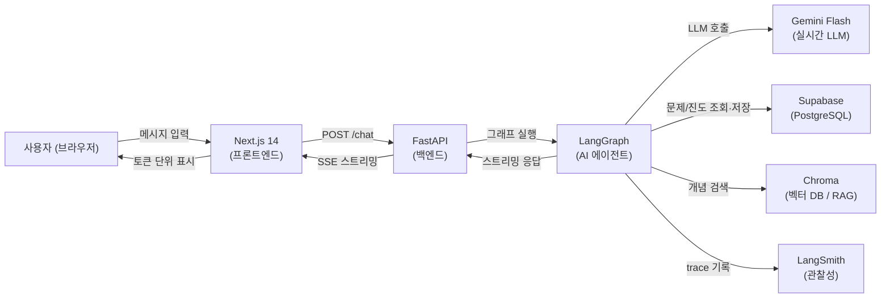
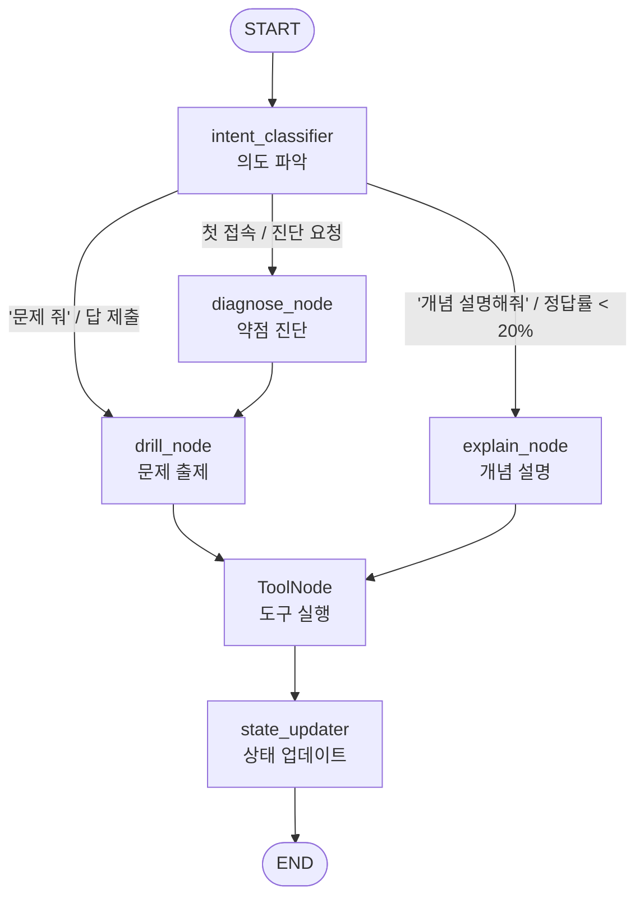

# 시스템 아키텍처 다이어그램 v0.1

**작성일:** 2026-05-18  
**기준:** 핸드북 5장 + 본인 상황 반영 (LLM: Gemini Flash / Claude API)

---

## 1. 데이터 흐름도

전체 시스템에서 데이터가 어떻게 움직이는지 보여준다.



---

## 2. LangGraph 노드 + 엣지 + 라우팅

사용자 입력이 들어왔을 때 AI가 거치는 단계들.



**라우팅 규칙 요약:**

| 조건 | 이동할 노드 |
|------|------------|
| 사용자가 "문제 줘" 또는 답 선택 | drill_node |
| 사용자가 개념 질문 또는 정답률 < 20% | explain_node |
| 첫 접속 또는 진단 요청 | diagnose_node |
| streak ≥ 3 | 카테고리 전환 후 drill_node |

---

## 3. State 스키마

AI가 대화 중 머릿속에 갖고 있는 정보.

```python
class TutorState(TypedDict):
    # 대화
    messages: list            # 전체 대화 기록
    current_mode: str         # "drill" | "explain" | "diagnose"
    pending_question: dict    # 현재 출제된 문제

    # 학생 정보
    student_level: str        # "beginner" | "intermediate" | "advanced"
    target_score: int         # 목표 점수 (예: 70)
    accuracy_by_category: dict  # 카테고리별 정답률 (0.0 ~ 1.0)

    # 학습 패턴
    recent_mistakes: list     # 최근 틀린 문제 목록
    streak: int               # 현재 연속 정답 수
    retry_count: int          # 재시도 횟수
```

**accuracy_by_category 구조:**
```python
accuracy_by_category = {
    "데이터 모델링 기초": 0.0,
    "데이터 모델과 SQL": 0.0,
    "SELECT & WHERE": 0.0,
    "함수": 0.0,
    "GROUP BY & ORDER BY": 0.0,
    "조인": 0.0,
    "서브쿼리 & Top N": 0.0,
    "집합 연산자 & 그룹 함수": 0.0,
    "윈도우 함수": 0.0,
    "SQL 활용 기타": 0.0,
    "관리 구문": 0.0,
}
```

---

## 4. 도구 명세 (4개)

LangGraph 에이전트가 실제로 사용하는 기능들.

| 도구 | 입력 | 출력 | 설명 |
|------|------|------|------|
| `generate_sqld_question` | category, difficulty | 문제 객체 | Supabase questions 테이블에서 문제 샘플링 |
| `grade_answer` | question_id, student_answer | 정오답 + 해설 | 결정론적 채점 (LLM 불필요) |
| `execute_sql` | query | 실행 결과 | SQLite 샌드박스에서 학생 SQL 직접 실행 |
| `explain_concept` | concept, level | 개념 설명 | Chroma 벡터 DB 검색 후 Gemini Flash로 설명 생성 |

---

## 5. LLM 사용 범위

실시간 서비스에서 LLM이 실제로 호출되는 경우만 정리.

| 상황 | 모델 | 노드 |
|------|------|------|
| 사용자 의도 분류 | Gemini Flash | intent_classifier |
| 오답 후 추가 질문 대화 | Gemini Flash | explain_node |
| 개념 설명 (RAG) | Gemini Flash | explain_node (explain_concept 도구) |
| 문제 추가 생성 / 데이터 분석 (배치) | Claude API | 별도 스크립트 (ingestion/) |

> 문제 출제와 채점은 LLM 불필요 — DB 조회 + 결정론적 로직으로 처리
